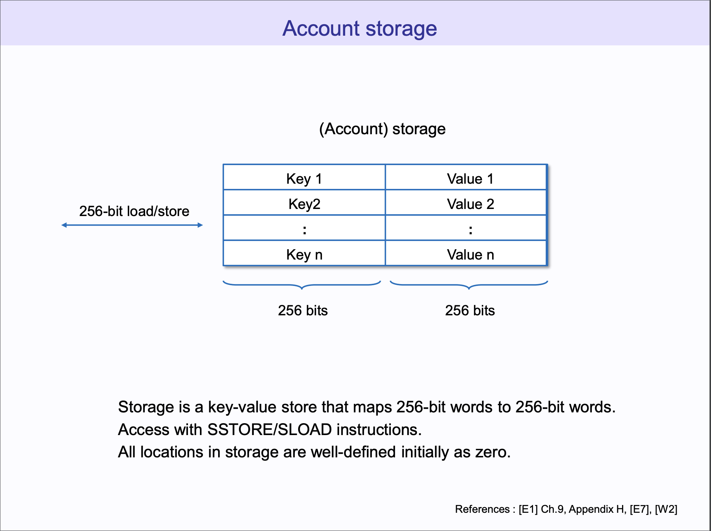

# Mapping

## 题目描述

[原题链接](https://capturetheether.com/challenges/math/mapping/)

原题目要求 MappingChallenge 合约的 isComplete 变量设置成 true。

## 运行

**安装 Rust**

```sh
$ curl --proto '=https' --tlsv1.2 -sSf https://sh.rustup.rs | sh
```
并根据提示继续操作。

**安装 svm**

[svm-rs](https://github.com/roynalnaruto/svm-rs) is Solidity Compiler Version Manager

```sh
$ cargo install svm-rs
```

**设置 solc 版本**
```sh
$ svm install 0.4.26

$ svm use 0.4.26

$ solc --version
```


**安装 Foundry**

根据 [Foundry 官方文档](https://getfoundry.sh/)配置好运行环境。

**运行测试**

```sh
$ cd WTF-CTF

$ forge test -C src/Capture_the_Ether/Math/Mapping --ffi -vvv
```

## 功能简述

在原题 `^0.4.21` 版本下，array 的成员 length 是可以修改的，在 `0.6.0` 版本之后，length 是只读的，无法修改。并且 forge-std/Test.sol 要求 solidity 版本大于等于 0.6.2: `pragma solidity >=0.6.2 <0.9.0`。也就是说，我们测试文件 `MappingChallenge.t.sol` 是无法 import `MappingChallenge.sol`。我们需要使用 0.4.26 版本的编译器单独编译并且部署 `MappingChallenge.sol`

为了能够复现这个 Challenge，我们需要一个 `BytesDeployer.sol`。
```solidity
// SPDX-License-Identifier: MIT

pragma solidity ^0.8.19;

import "forge-std/Test.sol";

contract Deployer is Test {
    ///@notice Compiles a contract before 0.6.0 and returns the address that the contract was deployeod to
    ///@notice If deployment fails, an error will be thrown
    ///@param path - The path of the contract. For example, the file name for "MappingChallenge.sol" is
    /// "src/Capture_the_Ether/Math/Mapping/MappingChallenge.sol"
    ///@return deployedAddress - The address that the contract was deployed to
    function deployContract(string memory path) public returns (address) {
        string memory bashCommand =
            string.concat('cast abi-encode "f(bytes)" $(solc ', string.concat(path, " --bin --optimize | tail -1)"));

        string[] memory inputs = new string[](3);
        inputs[0] = "bash";
        inputs[1] = "-c";
        inputs[2] = bashCommand;

        bytes memory bytecode = abi.decode(vm.ffi(inputs), (bytes));

        ///@notice deploy the bytecode with the create instruction
        address deployedAddress;
        assembly {
            deployedAddress := create(0, add(bytecode, 0x20), mload(bytecode))
        }

        ///@notice check that the deployment was successful
        require(deployedAddress != address(0), "YulDeployer could not deploy contract");

        ///@notice return the address that the contract was deployed to
        return deployedAddress;
    }
}
```

这个合约使用了 forge ffi 作弊码，它允许开发者执行任意 shell 命令并捕获输出。我们需要使用它来获取 `MappingChallenge.sol` 的 bytescode。合约里面的命令相当于在 terminal 执行 `cast abi-encode "f(bytes)" $(solc ./src/Capture_the_Ether/Math/Mapping/MappingChallenge.sol --bin --optimize | tail -1)` 然后使用 assembly 部署合约，并返回新合约地址。

然后在 MappingChallenge.t.sol 合约中 setUp 函数中利用 Deployer 部署好 MappingChallenge。

到现在，我们可以来解决 MappingChallenge。MappingChallenge 合约里面有两个 storage 变量，一个是 isComplete，存储在 slot 0；一个是 map， 存储在 slot 1。怎样通过修改 map 的值来影响 isComplete 的值？

下面科普一下以太坊的 World state，简单来说，所有的 Address 都有 Account state，由 nonce，balance，storage，code 组成，对于 EOA，storage 和 code 都是默认为空，对于 Contract account，code 用于存储合约代码，storage 用于存储合约里面的状态变量。


storage 是由 key-value 对组成，空间大小为 2^256，一般情况下是够用的：




MappingChallenge 里面的[存储布局](https://docs.soliditylang.org/en/develop/internals/layout_in_storage.html#mappings-and-dynamic-arrays)：

```sh
slot 0            : isComplete
slot 1            : map.length
...
slot keccak(1)    : map[0]
slot keccak(1) + 1: map[1]
slot keccak(1) + 2: map[2]
slot keccak(1) + 3: map[3]
slot keccak(1) + 4: map[4]
// ...
```

因此我们需要找到 map[x]，它的存储 slot 为 slot 0。
即：

$$Keccak(1) + x \equiv 0 \ (mod \ 2^{256})$$ 

$$x \equiv 2^{256} - Keccak(1) \ (mod \ 2^{256})$$

而 `UINT256_MAX + 1 = 2^256`，因此 `uint256 index = UINT256_MAX - uint256(keccak256(abi.encode(1))) + 1`

我们只需要将 map[index] 设置为非 0 值即可：

```solidity
        uint256 index = UINT256_MAX - uint256(keccak256(abi.encode(1))) + 1;
        bytes memory setCallData = abi.encodeWithSignature("set(uint256,uint256)", index, 1);

        (bool success,) = address(mappingChallenge).call{gas: 100000, value: 0}(setCallData);
        assertTrue(success);

        emit log_named_string("after hack, isComplete", mappingChallenge.isComplete() ? "true" : "false");

        assertTrue(mappingChallenge.isComplete());
```
